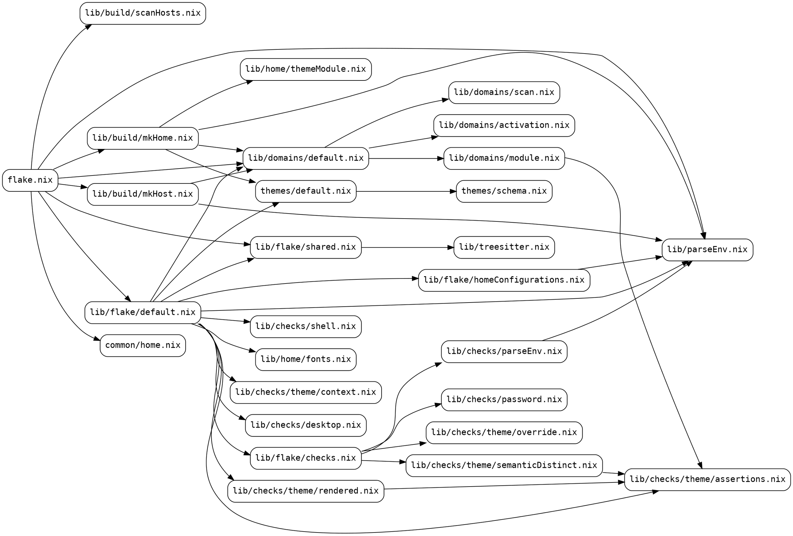

# angst flake analysis

*Generated: 2026-07-16 16:34*

## Table of Contents

- [1. Overview](#overview)
- [2. File Size Heatmap (top 30)](#file-size-heatmap-top-30)
- [3. Directory Size Breakdown](#directory-size-breakdown)
- [4. Attribute Surface](#attribute-surface)
- [5. Configuration Matrix](#configuration-matrix)
- [6. Render Coverage](#render-coverage)
- [7. Dependency Fan-in / Fan-out](#dependency-fan-in-fan-out)
- [8. Module Coupling Graph](#module-coupling-graph)
- [9. Build Graph Depth](#build-graph-depth)
- [10. Duplication Hotspots](#duplication-hotspots)
- [11. Hardcoded Strings Inventory](#hardcoded-strings-inventory)
- [12. Domain Inventory](#domain-inventory)
- [13. Theme Inventory](#theme-inventory)
- [14. Capabilities Inventory](#capabilities-inventory)
- [15. Toolchain Inventory](#toolchain-inventory)
- [16. Host Inventory](#host-inventory)
- [17. Option Inventory](#option-inventory)
- [18. Nix Idiom Usage](#nix-idiom-usage)
- [19. Conditional & Builtins Usage](#conditional-builtins-usage)
- [20. Complexity Metrics](#complexity-metrics)
- [21. "Interesting" Complexity Metrics](#interesting-complexity-metrics)
- [22. Error Handling](#error-handling)
- [23. Dead Code](#dead-code)
- [24. Anti-Patterns (statix)](#anti-patterns-statix)
- [25. Evaluation Cost](#evaluation-cost)
- [26. Technical Debt Score](#technical-debt-score)
- [27. Hotspot Table](#hotspot-table)


## 1. Overview

| Metric | Value |
|---|---|
| Files | 139 .nix files, 6049 LOC |
| Rust | 2268 LOC (tools/vm + tools/shell) |
| Scripts | 738 LOC (bash) |
| Docs | 1294 LOC (openwiki) |
| Flake check | ✓ passed |

## 2. File Size Heatmap (top 30)

| LOC | File | Section |
|---|---|---|
| 423 | domains/terminal/zellij/render.nix | domains |
| 423 | domains/shell/starship/render.nix | domains |
| 392 | lib/flake/default.nix | lib |
| 341 | domains/git/lazygit/render.nix | domains |
| 218 | themes/default.nix | themes |
| 199 | lib/virtualisation/vm-profile.nix | lib |
| 190 | lib/flake/shared.nix | lib |
| 171 | flake.nix | root |
| 147 | domains/wm/i3/render.nix | domains |
| 130 | domains/shell/nushell/render.nix | domains |
| 128 | domains/launcher/rofi/render.nix | domains |
| 109 | lib/build/mkHome.nix | lib |
| 105 | domains/sql-client/sqlit/render.nix | domains |
| 104 | lib/domains/module.nix | lib |
| 102 | lib/checks/password.nix | lib |
| 91 | lib/domains/activation.nix | lib |
| 89 | domains/terminal/ghostty/render.nix | domains |
| 88 | lib/build/mkHost.nix | lib |
| 76 | domains/llm/opencode/render.nix | domains |
| 73 | lib/domains/scan.nix | lib |
| 64 | lib/domains/domain-config.nix | lib |
| 62 | domains/terminal/zellij/module.nix | domains |
| 61 | lib/flake/checks.nix | lib |
| 57 | lib/checks/desktop.nix | lib |
| 56 | hosts/ssh/home.nix | hosts |
| 55 | lib/flake/homeConfigurations.nix | lib |
| 54 | lib/nixos/default.nix | lib |
| 53 | capabilities/graphical.nix | capabilities |
| 51 | domains/editor/nvim/render.nix | domains |
| 50 | lib/checks/shell.nix | lib |

## 3. Directory Size Breakdown

| Directory | .nix files | LOC | Extra |
|---|---|---|---|
| lib/ | 41 | 2223 |  |
| domains/ | 41 | 2345 |  |
| toolchains/ | 21 | 277 |  |
| themes/ | 11 | 449 |  |
| capabilities/ | 10 | 294 |  |
| hosts/ | 11 | 255 |  |
| common/ | 3 | 35 |  |
| scripts/ | 0 | 0 |  (+3 .sh files, 738 LOC) |

## 4. Attribute Surface

| Output | Count | Entries |
|---|---|---|
| packages | 7 | angst, default, res, shell, vm, vm-cli, vm-run |
| devShells | 3 | dev, safe, vm |
| apps | 11 | analyze, angst, check, lint-desktop, lint-shell, lint-themes, render, shell... |
| checks | 9 | check-parse-env, check-password, home-theme-override-test, lint-desktop, lint-shell, lint-themes, theme-override, theme-rendered... |
| nixosConfig | 3 | default, generic, personal |
| homeConfig | 5 | user, user-theme-override-test, user@generic, user@personal, user@ssh |

## 5. Configuration Matrix

| Dimension | Count | Values |
|---|---|---|
| Hosts | 3 | generic, personal, ssh |
| Themes | 9 | catppuccin-mocha, github, gotham, kanagawa, lotus, miasma, monochrome, noctis, rose-pine |
| Architectures | 1 | x86_64-linux |
| Domains | 16 | 16 domains in 12 categories |

> **Possible host/theme configurations:** 3 × 9 = 27

## 6. Render Coverage

| Feature | Count | Coverage |
|---|---|---|
| render module | 13 | 81% |
| home module | 11 | 68% |
| nixos module | 1 | 6% |
| activation script | 0 | 0% |
| check files | 0 | 0% |
| **total domains** | 16 | 100% |

## 7. Dependency Fan-in / Fan-out


### Most imported modules (fan-in)

| Imports | File |
|---|---|
| 20 | lib/toolchain.nix |
| 6 | lib/parseEnv.nix |
| 4 | lib/domains/default.nix |
| 4 | lib/checks/theme/assertions.nix |
| 3 | themes/default.nix |
| 2 | lib/flake/shared.nix |
| 2 | common/user.nix |
| 2 | lib/home/fonts.nix |
| 2 | lib/treesitter.nix |
| 1 | lib/build/scanHosts.nix |
| 1 | common/home.nix |
| 1 | lib/build/mkHome.nix |
| 1 | lib/build/mkHost.nix |
| 1 | lib/flake/default.nix |
| 1 | hosts/generic/user.nix |

### Largest dependency fan-out

| Imports | File |
|---|---|
| 12 | lib/flake/default.nix |
| 8 | flake.nix |
| 4 | lib/build/mkHome.nix |
| 4 | lib/flake/checks.nix |
| 3 | lib/domains/default.nix |
| 2 | lib/build/mkHost.nix |
| 1 | capabilities/graphical.nix |
| 1 | hosts/generic/default.nix |
| 1 | hosts/personal/default.nix |
| 1 | hosts/ssh/default.nix |
| 1 | lib/checks/parseEnv.nix |
| 1 | lib/checks/theme/default.nix |
| 1 | lib/checks/theme/rendered.nix |
| 1 | lib/checks/theme/semanticDistinct.nix |
| 1 | lib/domains/module.nix |

## 8. Module Coupling Graph


### Import tree (from flake.nix)

```
flake.nix
├── lib/build/scanHosts.nix
├── lib/domains/default.nix
│   ├── lib/domains/scan.nix
│   ├── lib/domains/activation.nix
│   └── lib/domains/module.nix
│       └── lib/checks/theme/assertions.nix
├── common/home.nix
├── lib/flake/shared.nix
│   └── lib/treesitter.nix
├── lib/build/mkHome.nix
│   ├── lib/parseEnv.nix
│   ├── themes/default.nix
│   │   └── themes/schema.nix
│   ├── lib/domains/default.nix
│   │   ├── lib/domains/scan.nix
│   │   ├── lib/domains/activation.nix
│   │   └── lib/domains/module.nix
│   │       └── lib/checks/theme/assertions.nix
│   └── lib/home/themeModule.nix
├── lib/build/mkHost.nix
│   ├── lib/parseEnv.nix
│   └── lib/domains/default.nix
│       ├── lib/domains/scan.nix
│       ├── lib/domains/activation.nix
│       └── lib/domains/module.nix
│           └── lib/checks/theme/assertions.nix
├── lib/flake/default.nix
│   ├── lib/parseEnv.nix
│   ├── lib/domains/default.nix
│   │   ├── lib/domains/scan.nix
│   │   ├── lib/domains/activation.nix
│   │   └── lib/domains/module.nix
│   │       └── lib/checks/theme/assertions.nix
│   ├── themes/default.nix
│   │   └── themes/schema.nix
│   ├── lib/home/fonts.nix
│   ├── lib/checks/theme/assertions.nix
│   ├── lib/checks/theme/context.nix
│   ├── lib/checks/desktop.nix
│   ├── lib/checks/shell.nix
│   ├── lib/checks/theme/rendered.nix
│   │   └── lib/checks/theme/assertions.nix
│   ├── lib/flake/homeConfigurations.nix
│   │   └── lib/parseEnv.nix
│   ├── lib/flake/checks.nix
│   │   ├── lib/checks/theme/semanticDistinct.nix
│   │   │   └── lib/checks/theme/assertions.nix
│   │   ├── lib/checks/theme/override.nix
│   │   ├── lib/checks/parseEnv.nix
│   │   │   └── lib/parseEnv.nix
│   │   └── lib/checks/password.nix
│   └── lib/flake/shared.nix
│       └── lib/treesitter.nix
└── lib/parseEnv.nix
```

### Graphviz (DOT)



## 9. Build Graph Depth


Maximum dependency depth from **flake.nix**: **4**

```
flake.nix
 ↓ ↓ ↓ ↓
(leaf)
```

## 10. Duplication Hotspots


### userEnv parsing (parseEnv.nix)

- `flake.nix`
- `lib/build/mkHome.nix`
- `lib/build/mkHost.nix`
- `lib/checks/parseEnv.nix`
- `lib/flake/checks.nix`
- `lib/flake/default.nix`
- `lib/flake/homeConfigurations.nix`

### "x86_64-linux" hardcoded

- `hosts/personal/default.nix`
- `hosts/ssh/home.nix`
- `hosts/ssh/default.nix`
- `hosts/generic/default.nix`
- `flake.nix`

### "proj/angst" hardcoded

- `hosts/personal/default.nix`
- `hosts/ssh/default.nix`
- `hosts/generic/default.nix`
- `flake.nix`
- `lib/build/mkHome.nix`
- `lib/build/mkHost.nix`
- `lib/virtualisation/detect.nix`
- `lib/virtualisation/is-qemu-vm.nix`
- `lib/flake/homeConfigurations.nix`
- `lib/flake/default.nix`

### "allowUnfree" hardcoded

- `flake.nix`
- `lib/nixos/default.nix`
- `lib/build/mkHome.nix`

### Key re-imports (dedup candidates)

- **parseEnv**: 7 files import it
  - `flake.nix`
  - `lib/build/mkHome.nix`
  - `lib/build/mkHost.nix`
  - `lib/checks/parseEnv.nix`
  - `lib/flake/checks.nix`
  - `lib/flake/default.nix`
  - `lib/flake/homeConfigurations.nix`
- **domains/default**: 4 files import it
  - `flake.nix`
  - `lib/build/mkHome.nix`
  - `lib/build/mkHost.nix`
  - `lib/flake/default.nix`
- **themes/default**: 3 files import it
  - `lib/build/mkHome.nix`
  - `lib/flake/default.nix`
  - `capabilities/graphical.nix`
- **shared.nix**: 2 files import it
  - `flake.nix`
  - `lib/flake/default.nix`

## 11. Hardcoded Strings Inventory

| String | Occurrences | Files | Description |
|---|---|---|---|
| "angst" | 75 | 26 | project name |
| "ANGST" | 39 | 11 | env var prefix |
| "nixpkgs" | 18 | 6 | flake input |
| "home-manager" | 12 | 6 | flake input |
| "proj/angst" | 11 | 10 | repo path |
| "x86_64" | 5 | 5 | architecture |
| "allowUnfree" | 3 | 3 | nixpkgs config |
| "generic" | 1 | 1 | default host |
| "monochrome" | 2 | 2 | default theme |
| "NIX_" | 5 | 2 | nix env vars |
| "ANGST_" | 39 | 11 | angst env vars |

## 12. Domain Inventory

| Category | Domains | Names | Render | Module | LOC |
|---|---|---|---|---|---|
| bar | 1 | i3status | 1 | 1 | 46 |
| editor | 1 | nvim | 1 | 1 | 75 |
| files | 1 | yazi | 1 | 1 | 46 |
| git | 1 | lazygit | 1 | 0 | 346 |
| http-client | 1 | posting | 1 | 0 | 52 |
| launcher | 1 | rofi | 1 | 1 | 148 |
| llm | 2 | cursor-cli,opencode | 1 | 0 | 86 |
| session | 1 | x11 | 0 | 1 | 21 |
| shell | 2 | nushell,starship | 2 | 2 | 589 |
| sql-client | 1 | sqlit | 1 | 0 | 110 |
| terminal | 3 | ghostty,tmux,zellij | 2 | 3 | 613 |
| wm | 1 | i3 | 1 | 1 | 213 |

## 13. Theme Inventory

> **See `nix flake show` for the full list.**

- **9 themes**, 226 total LOC

  - `catppuccin-mocha` — 27 LOC
  - `github` — 28 LOC
  - `gotham` — 28 LOC
  - `kanagawa` — 27 LOC
  - `lotus` — 28 LOC
  - `miasma` — 30 LOC
  - `monochrome` — 15 LOC (default)
  - `noctis` — 15 LOC
  - `rose-pine` — 28 LOC

## 14. Capabilities Inventory

> **See `nix flake show` for the full list.**

- **9 capabilities**, 272 total LOC

  - `audio` — 28 LOC
  - `clipboard` — 22 LOC
  - `container` — 42 LOC
  - `git` — 21 LOC
  - `graphical` — 53 LOC
  - `monitoring` — 21 LOC
  - `network` — 23 LOC
  - `search` — 23 LOC
  - `ssh` — 39 LOC

## 15. Toolchain Inventory

> **See `nix flake show` for the full list.**

- **20 toolchains**, 262 total LOC

  - `bash` — 11 LOC
  - `blade` — 14 LOC
  - `c` — 13 LOC
  - `clojure` — 13 LOC
  - `conf` — 8 LOC
  - `css` — 8 LOC
  - `docker` — 12 LOC
  - `go` — 13 LOC
  - `html` — 8 LOC
  - `java` — 13 LOC
  - `javascript` — 25 LOC
  - `json` — 9 LOC
  - `lua` — 12 LOC
  - `nix` — 21 LOC
  - `php` — 26 LOC
  - `python` — 16 LOC
  - `rust` — 13 LOC
  - `terraform` — 9 LOC
  - `toml` — 9 LOC
  - `xml` — 9 LOC

## 16. Host Inventory


- **generic/**
  - `configuration.nix` — 25 LOC
  - `default.nix` — 7 LOC
  - `hardware.nix` — 40 LOC
  - `home.nix` — 10 LOC
  - `user.nix` — 8 LOC

- **personal/**
  - `configuration.nix` — 35 LOC
  - `default.nix` — 23 LOC
  - `hardware.nix` — 35 LOC
  - `home.nix` — 10 LOC

- **ssh/**
  - `default.nix` — 6 LOC
  - `home.nix` — 56 LOC

## 17. Option Inventory

| Construct | Count |
|---|---|
| mkOption | 7 |
| mkEnableOption | 11 |
| mkIf | 33 |

### Option namespace references

| Namespace | References |
|---|---|
| capabilities | 9 |
| domains | 2 |
| angst | 1 |
| font | 1 |
| toolchains | 1 |
| theme | 1 |
| domainConfig | 1 |

## 18. Nix Idiom Usage

| Idiom | Count |
|---|---|
| lib.mkIf | 31 |
| lib.mkForce | 21 |
| lib.mkDefault | 12 |
| lib.mkEnableOption | 11 |
| lib.substring | 10 |
| lib.concatMap | 5 |
| lib.mapAttrs | 3 |
| lib.filterAttrs | 3 |
| lib.nameValuePair | 3 |
| lib.listToAttrs | 3 |
| lib.genAttrs | 1 |
| lib.optional | 1 |
| lib.optionalAttrs | 0 |
| lib.mkMerge | 0 |
| lib.pipe | 0 |
| lib.foldl' | 0 |
| lib.flatten | 0 |
| lib.zipAttrsWith | 0 |

## 19. Conditional & Builtins Usage


### Conditional logic

| Construct | Count | Files |
|---|---|---|
| mkIf | 33 | 28 |
| mkDefault | 12 | 4 |
| mkForce | 21 | 6 |
| mkOption | 7 | 7 |
| mkEnableOption | 11 | 10 |

### Builtins frequency (top 15)

| Builtin | Count |
|---|---|
| builtins.getEnv | 23 |
| builtins.pathExists | 21 |
| builtins.throw | 7 |
| builtins.readDir | 7 |
| builtins.attrNames | 7 |
| builtins.head | 5 |
| builtins.filter | 4 |
| builtins.readFile | 4 |
| builtins.stringLength | 3 |
| builtins.toJSON | 3 |
| builtins.substring | 2 |
| builtins.match | 1 |
| builtins.removeAttrs | 1 |
| builtins.isString | 1 |
| builtins.isAttrs | 1 |

## 20. Complexity Metrics


### Deep let-in nesting (depth >= 3)

- depth 20: `domains/shell/nushell/render.nix`
- depth 3: `lib/checks/password.nix`
- depth 4: `lib/domains/module.nix`
- depth 3: `themes/default.nix`

### String interpolation hotspots

-  151  `domains/terminal/zellij/render.nix`
-   71  `domains/shell/nushell/render.nix`
-   50  `domains/llm/opencode/render.nix`
-   46  `domains/sql-client/sqlit/render.nix`
-   45  `lib/flake/default.nix`
-   32  `domains/shell/starship/render.nix`
-   28  `domains/terminal/ghostty/render.nix`
-   22  `lib/flake/shared.nix`
-   17  `lib/domains/activation.nix`
-   16  `domains/wm/i3/render.nix`

### Large let blocks (> 50 lines) in render.nix

- 331 lines  `domains/git/lazygit/render.nix`:3
- 62 lines  `domains/llm/opencode/render.nix`:3
- 107 lines  `domains/shell/nushell/render.nix`:8
- 356 lines  `domains/terminal/zellij/render.nix`:8

## 21. "Interesting" Complexity Metrics


### Deepest Attrset Nesting

| Value | File |
|---|---|
| 7 | `domains/terminal/zellij/render.nix` |
| 6 | `lib/virtualisation/vm-profile.nix` |
| 6 | `lib/flake/default.nix` |
| 6 | `capabilities/graphical.nix` |
| 5 | `lib/virtualisation/vm-variant.nix` |
| 5 | `hosts/ssh/home.nix` |
| 5 | `domains/terminal/zellij/module.nix` |
| 5 | `domains/editor/nvim/render.nix` |

### Most Rec Blocks

| Value | File |
|---|---|
| 1 | `lib/build/mkHome.nix` |

### Most With Blocks

| Value | File |
|---|---|
| 6 | `toolchains/rust.nix` |
| 6 | `toolchains/python.nix` |
| 6 | `toolchains/java.nix` |
| 6 | `toolchains/go.nix` |
| 6 | `toolchains/clojure.nix` |
| 5 | `toolchains/php.nix` |
| 5 | `toolchains/nix.nix` |
| 5 | `toolchains/lua.nix` |

### Deepest Mkif Nesting

| Value | File |
|---|---|
| 1 | `lib/domains/domain-config.nix` |

## 22. Error Handling

| Construct | Count |
|---|---|
| throw | 11 |
| abort | 0 |
| assert | 6 |

### Throw locations

- `themes/default.nix:131:      builtins.throw "Theme '${name}' missing tokens: ${`
- `themes/default.nix:135:      builtins.throw "Theme '${name}' has invalid hex for: ${`
- `themes/default.nix:215:      builtins.throw "Unknown theme '${name}'. Available themes: ${`
- `flake.nix:149:              or (throw "HOST '${hostname}' not found. Available: ${toString (builtins.attrNames configs)}");`
- `lib/checks/theme/context.nix:21:      builtins.throw "No alternate theme available for override test (host uses ${hostTheme})"`
- `lib/checks/theme/override.nix:20:  throw "expected config.theme = ${overrideTheme}, got ${theme}"`
- `lib/checks/theme/override.nix:22:  throw "theme override did not reach rendered ghostty colors (expected ${overrideTheme} background.variant)"`
- `lib/flake/default.nix:93:      builtins.throw "Unknown domain render output: ${outputPath}"`
- `lib/domains/scan.nix:18:      builtins.throw "domains/${category}/${name}/meta.nix: 'xdg' and 'xdgFile' are mutually exclusive"`
- `lib/domains/scan.nix:20:      builtins.throw "domains/${category}/${name}/meta.nix: must set 'xdg', 'xdgFile', or 'customXdg = true'"`

## 23. Dead Code

✓ No dead code detected.

## 24. Anti-Patterns (statix)

✓ No anti-patterns detected.

## 25. Evaluation Cost

| Command | Result | Time |
|---|---|---|
| nix flake check | ✓ | 22.48s |
| nix flake show | ✓ | 0.44s |
| eval: packages.x86_64-linux | ✓ | 0.05s |
| eval: apps.x86_64-linux | ✓ | 0.05s |
| eval: checks.x86_64-linux | ✓ | 0.05s |

## 26. Technical Debt Score


### Architecture

- ✓ No cyclic imports
- ⚠ No parseEnv duplication (7 files)

### Portability

- ✓ Minimal x86_64 hardcoding (5 files)
- ⚠ Minimal proj/angst hardcoding (10 files)
- ✓ No absolute /nix/store paths (1 files)

### Configuration

- ✓ All domains have meta.nix

### Evaluation

- ✓ Statix clean
- ✓ No dead code (deadnix clean)

## 27. Hotspot Table

> Cross-references file size, git churn, dependency counts, and complexity into a single view.

> **Columns**: LOC (size), Churn (commits/year), Imports (fan-out), Dependents (fan-in),
> Complexity (derived from nesting depth, string interpolation, conditional count).

| File | LOC | Churn | Imports | Dependents | Complexity |
|---|---|---|---|---|---|
| `domains/terminal/zellij/render.nix` | 423 | 20 | 0 | 0 | High |
| `domains/shell/starship/render.nix` | 423 | 14 | 0 | 0 | Very High |
| `lib/flake/default.nix` | 392 | 30 | 12 | 1 | Very High |
| `domains/git/lazygit/render.nix` | 341 | 2 | 0 | 0 | Medium |
| `themes/default.nix` | 218 | 12 | 1 | 3 | Very High |
| `lib/virtualisation/vm-profile.nix` | 199 | 7 | 0 | 0 | High |
| `lib/flake/shared.nix` | 190 | 14 | 1 | 2 | Medium |
| `flake.nix` | 171 | 29 | 8 | 0 | Medium |
| `domains/wm/i3/render.nix` | 147 | 3 | 0 | 0 | High |
| `domains/shell/nushell/render.nix` | 130 | 6 | 0 | 0 | Very High |
| `domains/launcher/rofi/render.nix` | 128 | 3 | 0 | 0 | Low |
| `lib/build/mkHome.nix` | 109 | 20 | 4 | 1 | Low |
| `domains/sql-client/sqlit/render.nix` | 105 | 7 | 0 | 0 | Medium |
| `lib/domains/module.nix` | 104 | 11 | 1 | 1 | High |
| `lib/checks/password.nix` | 102 | 1 | 0 | 1 | Medium |
| `lib/domains/activation.nix` | 91 | 10 | 0 | 1 | High |
| `domains/terminal/ghostty/render.nix` | 89 | 6 | 0 | 0 | Medium |
| `lib/build/mkHost.nix` | 88 | 12 | 2 | 1 | Low |
| `domains/llm/opencode/render.nix` | 76 | 4 | 0 | 0 | Medium |
| `lib/domains/scan.nix` | 73 | 3 | 0 | 1 | Low |
| `lib/domains/domain-config.nix` | 64 | 7 | 0 | 0 | Low |
| `domains/terminal/zellij/module.nix` | 62 | 3 | 0 | 0 | Minimal |
| `lib/flake/checks.nix` | 61 | 9 | 4 | 1 | Minimal |
| `lib/checks/desktop.nix` | 57 | 7 | 0 | 1 | Low |
| `hosts/ssh/home.nix` | 56 | 8 | 0 | 0 | Minimal |

---

*Analysis complete.*
