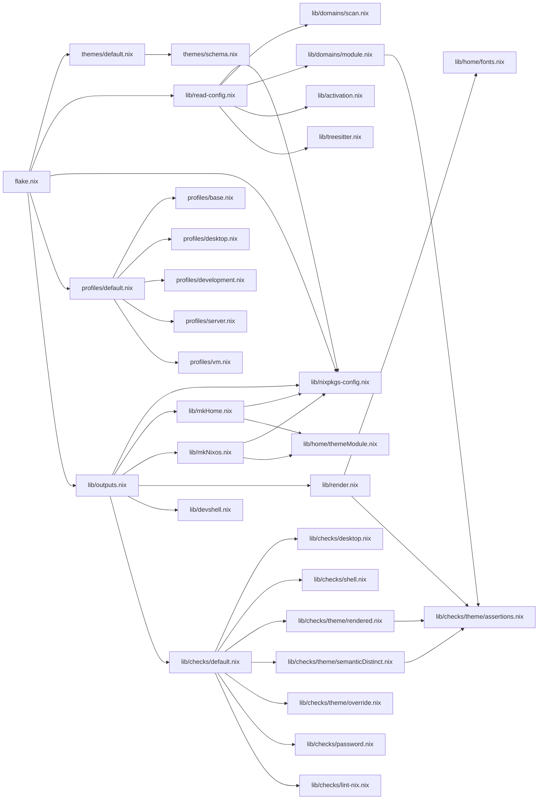

# angst flake analysis

*Generated: 2026-07-20 13:28*

## Table of Contents

- [1. Overview](#overview)
- [2. File Size Heatmap (top 30)](#file-size-heatmap-top-30)
- [3. Directory Size Breakdown](#directory-size-breakdown)
- [4. Attribute Surface](#attribute-surface)
- [5. Configuration Matrix](#configuration-matrix)
- [6. Domain Feature Coverage](#domain-feature-coverage)
- [7. Dependency Fan-in / Fan-out](#dependency-fan-in-fan-out)
- [8. Module Coupling Graph](#module-coupling-graph)
- [9. Build Graph Depth](#build-graph-depth)
- [10. Duplication Hotspots](#duplication-hotspots)
- [11. Hardcoded Strings Inventory](#hardcoded-strings-inventory)
- [12. Domain Inventory](#domain-inventory)
- [13. Theme Inventory](#theme-inventory)
- [14. Capabilities Inventory](#capabilities-inventory)
- [15. Toolchain Inventory](#toolchain-inventory)
- [16. Host Inventory](#host-inventory)
- [17. Option Inventory](#option-inventory)
- [18. Nix Idiom Usage](#nix-idiom-usage)
- [19. Conditional & Builtins Usage](#conditional-builtins-usage)
- [20. Complexity Metrics](#complexity-metrics)
- [21. "Interesting" Complexity Metrics](#interesting-complexity-metrics)
- [22. Error Handling](#error-handling)
- [23. Dead Code](#dead-code)
- [24. Anti-Patterns (statix)](#anti-patterns-statix)
- [25. Evaluation Cost](#evaluation-cost)
- [26. Technical Debt Score](#technical-debt-score)
- [27. Hotspot Table](#hotspot-table)
- [28. Stability Index](#stability-index)
- [29. Theme × Domain Coverage](#theme-domain-coverage)
- [30. Domain Features](#domain-features)
- [31. Check Results Breakdown](#check-results-breakdown)
- [32. Rendered Output Sizes](#rendered-output-sizes)
- [33. Growth Velocity](#growth-velocity)
- [34. Theme Token Usage Audit](#theme-token-usage-audit)


## 1. Overview

| Metric | Value |
|---|---|
| Files | 140 .nix files, 5367 LOC |
| Rust | 2174 LOC (tools/vm + tools/shell) |
| Scripts | 286 LOC (bash) |
| Docs | 1294 LOC (openwiki) |
| Flake check | ✗        - You must set the option ‘boot.loader.grub.devices’ or 'boot.loader.grub.mirroredBoots' to make the system bootable. |
## 2. File Size Heatmap (top 30)

| LOC | File | Section |
|---|---|---|
| 341 | domains/git/lazygit/render.nix | domains |
| 269 | domains/shell/starship/modules.nix | domains |
| 258 | domains/terminal/zellij/render.nix | domains |
| 218 | themes/default.nix | themes |
| 199 | lib/virtualization/vm-profile.nix | lib |
| 162 | domains/shell/starship/render.nix | domains |
| 150 | domains/terminal/zellij/theme.nix | domains |
| 147 | domains/wm/i3/render.nix | domains |
| 130 | domains/shell/nushell/render.nix | domains |
| 128 | domains/launcher/rofi/render.nix | domains |
| 105 | lib/domains/module.nix | lib |
| 105 | domains/sql-client/sqlit/render.nix | domains |
| 101 | lib/outputs.nix | lib |
| 89 | domains/terminal/ghostty/render.nix | domains |
| 84 | lib/activation.nix | lib |
| 78 | lib/mkNixos.nix | lib |
| 77 | lib/read-config.nix | lib |
| 76 | domains/agents/opencode/render.nix | domains |
| 73 | lib/domains/scan.nix | lib |
| 66 | lib/mkHome.nix | lib |
| 65 | domains/terminal/zellij/layout.nix | domains |
| 64 | lib/domain.nix | lib |
| 63 | domains/terminal/tmux/render.nix | domains |
| 62 | domains/terminal/zellij/module.nix | domains |
| 60 | lib/nixos/default.nix | lib |
| 60 | lib/checks/default.nix | lib |
| 57 | lib/checks/desktop.nix | lib |
| 54 | lib/devshell.nix | lib |
| 53 | capabilities/graphical.nix | capabilities |
| 50 | lib/checks/shell.nix | lib |
## 3. Directory Size Breakdown

| Directory | .nix files | LOC | Extra |
|---|---|---|---|
| lib/ | 39 | 1644 |  |
| domains/ | 50 | 2527 |  |
| toolchains/ | 23 | 299 |  |
| themes/ | 11 | 449 |  |
| capabilities/ | 9 | 272 |  |
| scripts/ | 0 | 0 |  (+2 .sh files, 286 LOC) |
## 4. Attribute Surface

| Output | Count | Entries |
|---|---|---|
| packages | 7 | angst, default, res, shell, vm, vm-cli, vm-run |
| devShells | 3 | dev, safe, vm |
| apps | 12 | analyze, analyze-to-file, angst, check, lint-desktop, lint-shell, lint-themes, render... |
| checks | 9 | check-password, home-theme-override-test, lint-desktop, lint-nix, lint-shell, lint-themes, theme-override, theme-rendered... |
| nixosConfig | 2 | current, nixos |
| homeConfig | 4 | current, user, user-theme-override-test, user@nixos |
## 5. Configuration Matrix

| Dimension | Count | Values |
|---|---|---|
| Hosts | 0 |  |
| Themes | 9 | catppuccin-mocha, github, gotham, kanagawa, lotus, miasma, monochrome, noctis, rose-pine |
| Architectures | 1 | x86_64-linux |
| Domains | 16 | 16 domains in 12 categories |

> **Possible host/theme configurations:** 0 × 9 = 0
## 6. Domain Feature Coverage

| Feature | Count | Coverage |
|---|---|---|
| render.nix | 15 | 93% |
| nixos.nix | 1 | 6% |
| domain checks | 0 | 0% |
| **total domains** | 16 | 100% |
## 7. Dependency Fan-in / Fan-out


### Most imported modules (fan-in)

| Direct | Transitive | File |
|---|---|---|
| 22 | 22 | lib/toolchain.nix |
| 6 | 6 | lib/nixpkgs-config.nix |
| 4 | 8 | lib/checks/theme/assertions.nix |
| 2 | 4 | lib/home/fonts.nix |
| 2 | 3 | lib/treesitter.nix |
| 2 | 4 | lib/home/themeModule.nix |
| 1 | 1 | domains/shell/starship/modules.nix |
| 1 | 1 | domains/terminal/zellij/theme.nix |
| 1 | 1 | domains/terminal/zellij/layout.nix |
| 1 | 1 | themes/default.nix |
| 1 | 1 | lib/read-config.nix |
| 1 | 1 | profiles/default.nix |
| 1 | 1 | lib/outputs.nix |
| 1 | 3 | lib/checks/desktop.nix |
| 1 | 3 | lib/checks/shell.nix |

### Largest dependency fan-out

| Imports | File |
|---|---|
| 7 | lib/checks/default.nix |
| 6 | lib/outputs.nix |
| 5 | flake.nix |
| 5 | lib/read-config.nix |
| 5 | profiles/default.nix |
| 2 | domains/terminal/zellij/render.nix |
| 2 | lib/mkHome.nix |
| 2 | lib/mkNixos.nix |
| 2 | lib/render.nix |
| 1 | domains/shell/starship/render.nix |
| 1 | lib/checks/theme/default.nix |
| 1 | lib/checks/theme/rendered.nix |
| 1 | lib/checks/theme/semanticDistinct.nix |
| 1 | lib/domains/module.nix |
| 1 | lib/home/font.nix |
## 8. Module Coupling Graph


### Import tree (from flake.nix)

```
flake.nix
├── themes/default.nix
│   └── themes/schema.nix
├── lib/read-config.nix
│   ├── lib/nixpkgs-config.nix
│   ├── lib/domains/scan.nix
│   ├── lib/domains/module.nix
│   │   └── lib/checks/theme/assertions.nix
│   ├── lib/activation.nix
│   └── lib/treesitter.nix
├── lib/nixpkgs-config.nix
├── profiles/default.nix
│   ├── profiles/base.nix
│   ├── profiles/desktop.nix
│   ├── profiles/development.nix
│   ├── profiles/server.nix
│   └── profiles/vm.nix
└── lib/outputs.nix
    ├── lib/nixpkgs-config.nix
    ├── lib/mkHome.nix
    │   ├── lib/nixpkgs-config.nix
    │   └── lib/home/themeModule.nix
    ├── lib/mkNixos.nix
    │   ├── lib/nixpkgs-config.nix
    │   └── lib/home/themeModule.nix
    ├── lib/render.nix
    │   ├── lib/home/fonts.nix
    │   └── lib/checks/theme/assertions.nix
    ├── lib/devshell.nix
    └── lib/checks/default.nix
        ├── lib/checks/desktop.nix
        ├── lib/checks/shell.nix
        ├── lib/checks/theme/rendered.nix
        │   └── lib/checks/theme/assertions.nix
        ├── lib/checks/theme/semanticDistinct.nix
        │   └── lib/checks/theme/assertions.nix
        ├── lib/checks/theme/override.nix
        ├── lib/checks/password.nix
        └── lib/checks/lint-nix.nix
```

### Architectural layer validation


Allowed direction (foundational → specific):

```
flake.nix
 ↓
lib
 ↓
common
 ↓
capabilities
 ↓
domains
 ↓
themes
 ↓
toolchains
 ↓
hosts
 ↓
scripts
```


**No layer violations.**


### Module Dependency Graph (Mermaid)


## 9. Build Graph Depth


Maximum dependency depth from **flake.nix**: **4**

Longest import chain:

```
flake.nix
 └─ lib/outputs.nix
     └─ lib/checks/default.nix
         └─ lib/checks/theme/rendered.nix
             └─ lib/checks/theme/assertions.nix
```
## 10. Duplication Hotspots


### userEnv parsing (parseEnv.nix)

_(none found)_

### "x86_64-linux" hardcoded

- `lib/read-config.nix`

### "proj/angst" hardcoded

- `lib/read-config.nix`

### "allowUnfree" hardcoded

- `lib/nixpkgs-config.nix`

### Key re-imports (dedup candidates)

## 11. Hardcoded Strings Inventory

| String | Occurrences | Files | Description |
|---|---|---|---|
| "angst" | 63 | 22 | project name |
| "ANGST" | 5 | 3 | env var prefix |
| "nixpkgs" | 16 | 6 | flake input |
| "home-manager" | 13 | 6 | flake input |
| "proj/angst" | 1 | 1 | repo path |
| "x86_64" | 1 | 1 | architecture |
| "allowUnfree" | 1 | 1 | nixpkgs config |
| "generic" | 0 | 0 | default host |
| "monochrome" | 2 | 2 | default theme |
| "NIX_" | 1 | 1 | nix env vars |
| "ANGST_" | 5 | 3 | angst env vars |
## 12. Domain Inventory

| Category | Domains | Names | LOC |
|---|---|---|---|
| agents | 2 | cursor-cli,opencode | 98 |
| bar | 1 | i3status | 46 |
| editor | 1 | nvim | 54 |
| files | 1 | yazi | 46 |
| git | 1 | lazygit | 358 |
| http-client | 1 | posting | 64 |
| launcher | 1 | rofi | 148 |
| session | 1 | x11 | 55 |
| shell | 2 | nushell,starship | 597 |
| sql-client | 1 | sqlit | 122 |
| terminal | 3 | ghostty,tmux,zellij | 726 |
| wm | 1 | i3 | 213 |
## 13. Theme Inventory

> **See `nix flake show` for the full list.**

- **9 themes**, 226 total LOC

  - `catppuccin-mocha` — 27 LOC
  - `github` — 28 LOC
  - `gotham` — 28 LOC
  - `kanagawa` — 27 LOC
  - `lotus` — 28 LOC
  - `miasma` — 30 LOC
  - `monochrome` — 15 LOC (default)
  - `noctis` — 15 LOC
  - `rose-pine` — 28 LOC
## 14. Capabilities Inventory

> **See `nix flake show` for the full list.**

- **9 capabilities**, 272 total LOC

  - `audio` — 28 LOC
  - `clipboard` — 22 LOC
  - `container` — 42 LOC
  - `git` — 21 LOC
  - `graphical` — 53 LOC
  - `monitoring` — 21 LOC
  - `network` — 23 LOC
  - `search` — 23 LOC
  - `ssh` — 39 LOC
## 15. Toolchain Inventory

> **See `nix flake show` for the full list.**

- **22 toolchains**, 284 total LOC

  - `bash` — 11 LOC
  - `blade` — 14 LOC
  - `c` — 13 LOC
  - `clojure` — 13 LOC
  - `conf` — 8 LOC
  - `css` — 8 LOC
  - `docker` — 12 LOC
  - `go` — 13 LOC
  - `html` — 8 LOC
  - `java` — 13 LOC
  - `javascript` — 25 LOC
  - `json` — 9 LOC
  - `just` — 8 LOC
  - `lua` — 12 LOC
  - `markdown` — 14 LOC
  - `nix` — 21 LOC
  - `php` — 26 LOC
  - `python` — 16 LOC
  - `rust` — 13 LOC
  - `terraform` — 9 LOC
  - `toml` — 9 LOC
  - `xml` — 9 LOC
## 16. Host Inventory

(no hosts/)
## 17. Option Inventory

| Construct | Count |
|---|---|
| mkOption | 7 |
| mkEnableOption | 11 |
| mkIf | 35 |

### Option namespace references

| Namespace | References |
|---|---|
| capabilities | 9 |
| domains | 2 |
| angst | 1 |
| domainConfig | 1 |
| font | 1 |
| toolchains | 1 |
| theme | 1 |
## 18. Nix Idiom Usage

| Idiom | Count |
|---|---|
| lib.mkIf | 33 |
| lib.mkForce | 17 |
| lib.mkDefault | 12 |
| lib.mkEnableOption | 11 |
| lib.types | 9 |
| lib.concatMap | 7 |
| lib.mapAttrs | 3 |
| lib.filterAttrs | 3 |
| lib.nameValuePair | 2 |
| lib.listToAttrs | 2 |
| lib.optional | 1 |
| lib.genAttrs | 0 |
| lib.optionalAttrs | 0 |
| lib.mkMerge | 0 |
| lib.pipe | 0 |
| lib.foldl' | 0 |
| lib.flatten | 0 |
| lib.zipAttrsWith | 0 |
## 19. Conditional & Builtins Usage


### Conditional logic

| Construct | Count | Files |
|---|---|---|
| mkIf | 35 | 30 |
| mkDefault | 12 | 5 |
| mkForce | 17 | 5 |
| mkOption | 7 | 7 |
| mkEnableOption | 11 | 10 |

### Builtins frequency (top 15)

| Builtin | Count |
|---|---|
| builtins.throw | 11 |
| builtins.pathExists | 9 |
| builtins.attrNames | 6 |
| builtins.readDir | 5 |
| builtins.concatStringsSep | 5 |
| builtins.filter | 3 |
| builtins.readFile | 3 |
| builtins.toJSON | 3 |
| builtins.match | 2 |
| builtins.elem | 2 |
| builtins.head | 2 |
| builtins.removeAttrs | 1 |
| builtins.isString | 1 |
| builtins.isAttrs | 1 |
| builtins.dirOf | 1 |
## 20. Complexity Metrics


### All files with non-trivial complexity

| Score | File | Contributing factors |
|---|---|---|
| 7 | `themes/default.nix` | depth=3, interp=27, LOC=218 |
| 6 | `lib/virtualization/vm-profile.nix` | interp=12, cond=14, LOC=199 |
| 6 | `lib/domains/module.nix` | depth=4, interp=18, LOC=105 |
| 6 | `domains/shell/starship/render.nix` | depth=2, interp=31, LOC=162 |
| 5 | `domains/wm/i3/render.nix` | depth=2, interp=43, LOC=147 |
| 5 | `domains/terminal/zellij/render.nix` | interp=49, LOC=258 |
| 4 | `lib/outputs.nix` | interp=33, LOC=101 |
| 4 | `lib/activation.nix` | depth=2, interp=27, LOC=84 |
| 4 | `domains/terminal/zellij/theme.nix` | interp=94, LOC=150 |
| 4 | `domains/sql-client/sqlit/render.nix` | interp=48, LOC=105 |
| 4 | `domains/shell/nushell/render.nix` | interp=72, LOC=130 |
| 4 | `domains/git/lazygit/render.nix` | interp=11, LOC=341 |
| 3 | `domains/terminal/ghostty/render.nix` | interp=28, LOC=89 |
| 3 | `domains/agents/opencode/render.nix` | interp=50 |
| 2 | `profiles/default.nix` | depth=2, interp=10 |
| 2 | `lib/nixos/default.nix` | cond=7 |
| 2 | `lib/domains/scan.nix` | depth=2, interp=9 |
| 2 | `lib/domain.nix` | depth=2, interp=15 |
| 2 | `domains/terminal/zellij/layout.nix` | interp=24 |
| 2 | `domains/terminal/tmux/render.nix` | interp=21 |
| 2 | `domains/shell/starship/modules.nix` | LOC=269 |
| 1 | `lib/virtualization/runtime.nix` | cond=4 |
| 1 | `lib/virtualization/host-mount.nix` | interp=9 |
| 1 | `lib/treesitter.nix` | interp=15 |
| 1 | `lib/read-config.nix` | depth=2 |
| 1 | `lib/mkNixos.nix` | depth=2 |
| 1 | `lib/devshell.nix` | interp=12 |
| 1 | `lib/checks/theme/assertions.nix` | depth=2 |
| 1 | `lib/checks/desktop.nix` | interp=6 |
| 1 | `domains/wm/i3/module.nix` | interp=6 |
| 1 | `domains/session/x11/render.nix` | interp=6 |
| 1 | `domains/launcher/rofi/render.nix` | LOC=128 |
| 1 | `domains/http-client/posting/render.nix` | interp=10 |
| 1 | `domains/files/yazi/render.nix` | interp=9 |
| 1 | `domains/editor/nvim/render.nix` | interp=13 |
## 21. "Interesting" Complexity Metrics


### Deepest Attrset Nesting

| Value | File |
|---|---|
| 7 | `domains/terminal/zellij/render.nix` |
| 6 | `lib/virtualization/vm-profile.nix` |
| 6 | `capabilities/graphical.nix` |
| 5 | `lib/virtualization/vm-variant.nix` |
| 5 | `lib/outputs.nix` |
| 5 | `domains/terminal/zellij/module.nix` |
| 5 | `domains/terminal/zellij/layout.nix` |
| 4 | `themes/default.nix` |

### Most Rec Blocks

| Value | File |
|---|---|
| 1 | `lib/render.nix` |
| 1 | `lib/outputs.nix` |

### Most With Blocks

| Value | File |
|---|---|
| 6 | `toolchains/rust.nix` |
| 6 | `toolchains/python.nix` |
| 6 | `toolchains/java.nix` |
| 6 | `toolchains/go.nix` |
| 6 | `toolchains/clojure.nix` |
| 5 | `toolchains/php.nix` |
| 5 | `toolchains/nix.nix` |
| 5 | `toolchains/lua.nix` |

### Deepest Mkif Nesting

| Value | File |
|---|---|
| 1 | `lib/domain.nix` |

### Largest Attrset

| Value | File |
|---|---|
| 157 | `domains/shell/starship/modules.nix` |
| 61 | `lib/virtualization/vm-profile.nix` |
| 56 | `domains/agents/opencode/render.nix` |
| 41 | `themes/default.nix` |
| 34 | `lib/outputs.nix` |
| 19 | `lib/checks/default.nix` |
| 18 | `lib/nixos/default.nix` |
| 17 | `lib/read-config.nix` |

### Largest List

| Value | File |
|---|---|
| 260 | `domains/shell/starship/modules.nix` |
| 217 | `domains/terminal/zellij/render.nix` |
| 203 | `domains/git/lazygit/render.nix` |
| 200 | `themes/default.nix` |
| 144 | `lib/virtualization/vm-profile.nix` |
| 116 | `domains/shell/starship/render.nix` |
| 113 | `domains/launcher/rofi/render.nix` |
| 110 | `domains/wm/i3/render.nix` |

### Longest String (Lines)

| Value | File |
|---|---|
| 326 | `domains/git/lazygit/render.nix` |
| 145 | `domains/terminal/zellij/theme.nix` |
| 140 | `domains/terminal/zellij/render.nix` |
| 103 | `domains/shell/nushell/render.nix` |
| 102 | `domains/wm/i3/render.nix` |
| 97 | `domains/launcher/rofi/render.nix` |
| 48 | `domains/shell/starship/render.nix` |
| 43 | `domains/terminal/zellij/layout.nix` |

### Deepest Function Pipeline (|>)

| Value | File |
|---|---|
## 22. Error Handling

| Construct | Count |
|---|---|
| throw | 14 |
| abort | 0 |
| assert | 0 |

### Throw locations

- `themes/default.nix:131:      builtins.throw "Theme '${name}' missing tokens: ${`
- `themes/default.nix:135:      builtins.throw "Theme '${name}' has invalid hex for: ${`
- `themes/default.nix:215:      builtins.throw "Unknown theme '${name}'. Available themes: ${`
- `profiles/default.nix:10:      builtins.throw "Unknown domain '${name}'. Available: ${builtins.concatStringsSep ", " (map (e: "${e.category}.${e.name}") entries)}"`
- `profiles/default.nix:29:    then builtins.throw "Unknown profiles: ${builtins.concatStringsSep ", " unknown}. Valid: ${builtins.concatStringsSep ", " validNames}"`
- `lib/checks/theme/context.nix:21:      builtins.throw "No alternate theme available for override test (host uses ${hostTheme})"`
- `lib/checks/theme/override.nix:20:  throw "expected config.theme = ${overrideTheme}, got ${theme}"`
- `lib/checks/theme/override.nix:22:  throw "theme override did not reach rendered ghostty colors (expected ${overrideTheme} background.variant)"`
- `lib/render.nix:24:    in if matches == [] then builtins.throw "Unknown domain render output: ${outputPath}"`
- `lib/domains/scan.nix:18:      builtins.throw "domains/${category}/${name}/meta.nix: 'xdg' and 'xdgFile' are mutually exclusive"`
- `lib/domains/scan.nix:20:      builtins.throw "domains/${category}/${name}/meta.nix: must set 'xdg', 'xdgFile', or 'customXdg = true'"`
- `lib/read-config.nix:73:          then builtins.throw "Unknown toolchains: ${builtins.concatStringsSep ", " unknown}. Valid: ${builtins.concatStringsSep ", " _bareNames}"`
## 23. Dead Code

✓ No dead code detected.
## 24. Anti-Patterns (statix)

✓ No anti-patterns detected.
## 25. Evaluation Cost


### Evaluation (attribute resolution)

| Command | Result | Time |
|---|---|---|
| nix flake show | ✓ | 2.47s |
| packages.x86_64-linux | ✓ | 0.05s |
| apps.x86_64-linux | ✓ | 0.05s |
| checks.x86_64-linux | ✓ | 0.05s |

### Build (realisation)

| Command | Result | Time |
|---|---|---|
| nix flake check | ✗ | 10.85s |
## 26. Technical Debt Score


### Architecture

- ✓ No cyclic imports
- ✓ parseEnv imported from 0 files

### Portability

- ✓ 1 architecture-specific literals (x86_64-linux)
- ✓ 1 repository path literals (proj/angst)
- ✓ 1 files reference /nix/store

### Configuration

- ✓ All domains have meta.nix

### Evaluation

- ✓ Statix clean
- ✓ No dead code (deadnix clean)
## 27. Hotspot Table

> Cross-references file size, git churn, dependency counts, and complexity into a single view.

> **Columns**: LOC (size), Churn (commits/year), Imports (fan-out), Dependents (fan-in),
> Complexity (derived from nesting depth, string interpolation, conditional count).

| File | LOC | Churn | Imports | Dependents | Complexity | Score |
|---|---|---|---|---|---|---|
| `domains/git/lazygit/render.nix` | 341 | 2 | 0 | 0 | Medium | 4 |
| `domains/shell/starship/modules.nix` | 269 | 1 | 0 | 1 | Low | 2 |
| `domains/terminal/zellij/render.nix` | 258 | 21 | 2 | 0 | High | 5 |
| `themes/default.nix` | 218 | 12 | 1 | 1 | Very High | 7 |
| `lib/virtualization/vm-profile.nix` | 199 | 1 | 0 | 0 | High | 6 |
| `domains/shell/starship/render.nix` | 162 | 15 | 1 | 0 | High | 6 |
| `domains/terminal/zellij/theme.nix` | 150 | 1 | 0 | 1 | Medium | 4 |
| `domains/wm/i3/render.nix` | 147 | 3 | 0 | 0 | High | 5 |
| `domains/shell/nushell/render.nix` | 130 | 6 | 0 | 0 | Very High | 7 |
| `domains/launcher/rofi/render.nix` | 128 | 3 | 0 | 0 | Low | 1 |
| `lib/domains/module.nix` | 105 | 12 | 1 | 1 | High | 6 |
| `domains/sql-client/sqlit/render.nix` | 105 | 7 | 0 | 0 | Medium | 4 |
| `lib/outputs.nix` | 101 | 6 | 6 | 1 | Medium | 4 |
| `domains/terminal/ghostty/render.nix` | 89 | 6 | 0 | 0 | Medium | 3 |
| `lib/activation.nix` | 84 | 0 | 0 | 1 | Medium | 4 |
| `lib/mkNixos.nix` | 78 | 0 | 2 | 1 | Low | 1 |
| `lib/read-config.nix` | 77 | 6 | 5 | 1 | Low | 1 |
| `domains/agents/opencode/render.nix` | 76 | 1 | 0 | 0 | Medium | 3 |
| `lib/domains/scan.nix` | 73 | 3 | 0 | 1 | Low | 2 |
| `lib/mkHome.nix` | 66 | 11 | 2 | 1 | Minimal | 0 |
| `domains/terminal/zellij/layout.nix` | 65 | 1 | 0 | 1 | Low | 2 |
| `lib/domain.nix` | 64 | 0 | 0 | 0 | Low | 2 |
| `domains/terminal/tmux/render.nix` | 63 | 1 | 0 | 0 | Low | 2 |
| `domains/terminal/zellij/module.nix` | 62 | 3 | 0 | 0 | Minimal | 0 |
| `lib/nixos/default.nix` | 60 | 10 | 1 | 0 | Low | 2 |
## 28. Stability Index

> Cross-references git churn with file recency. **Hot** = high churn + recently modified, **Active** = moderate churn, **Stable** = low churn, **Archived** = no changes in 6+ months.

| File | Churn | Last changed | Label |
|---|---|---|---|
| `flake.nix` | 31 | 2026-07-19 | Hot |
| `domains/terminal/zellij/render.nix` | 21 | 2026-07-19 | Hot |
| `domains/shell/starship/render.nix` | 15 | 2026-07-19 | Hot |
| `themes/miasma.nix` | 13 | 2026-07-16 | Hot |
| `themes/default.nix` | 12 | 2026-07-16 | Hot |
| `lib/domains/module.nix` | 12 | 2026-07-20 | Hot |
| `lib/mkHome.nix` | 11 | 2026-06-12 | Hot |
| `themes/catppuccin-mocha.nix` | 10 | 2026-07-10 | Hot |
| `themes/kanagawa.nix` | 10 | 2026-07-10 | Hot |
| `lib/nixos/default.nix` | 10 | 2026-07-19 | Hot |
| `toolchains/php.nix` | 9 | 2026-07-02 | Active |
| `domains/editor/nvim/module.nix` | 9 | 2026-07-06 | Active |
| `themes/monochrome.nix` | 9 | 2026-07-10 | Active |
| `themes/noctis.nix` | 9 | 2026-07-10 | Active |
| `domains/wm/i3/module.nix` | 9 | 2026-07-12 | Active |
| `lib/checks/theme/rendered.nix` | 9 | 2026-07-12 | Active |
| `toolchains/javascript.nix` | 9 | 2026-07-14 | Active |
| `themes/schema.nix` | 8 | 2026-07-10 | Active |
| `domains/session/x11/module.nix` | 7 | 2026-07-06 | Active |
| `domains/sql-client/sqlit/render.nix` | 7 | 2026-07-10 | Active |
## 30. Theme × Domain Coverage

> ✓ = render produces output, ✗ = render throws, — = no render.nix

| Theme | agents/cursor-cli | agents/opencode | bar/i3status | editor/nvim | files/yazi | git/lazygit | http-client/posting | launcher/rofi | session/x11 | shell/nushell | shell/starship | sql-client/sqlit | terminal/ghostty | terminal/tmux | terminal/zellij | wm/i3 |
|---|---|---|---|---|---|---|---|---|---|---|---|---|---|---|---|---|
| `catppuccin-mocha` | — |  |  |  |  |  |  |  |  |  |  |  |  |  |  |  |
| `github` | — |  |  |  |  |  |  |  |  |  |  |  |  |  |  |  |
| `gotham` | — |  |  |  |  |  |  |  |  |  |  |  |  |  |  |  |
| `kanagawa` | — |  |  |  |  |  |  |  |  |  |  |  |  |  |  |  |
| `lotus` | — |  |  |  |  |  |  |  |  |  |  |  |  |  |  |  |
| `miasma` | — |  |  |  |  |  |  |  |  |  |  |  |  |  |  |  |
| `monochrome` | — |  |  |  |  |  |  |  |  |  |  |  |  |  |  |  |
| `noctis` | — |  |  |  |  |  |  |  |  |  |  |  |  |  |  |  |
| `rose-pine` | — |  |  |  |  |  |  |  |  |  |  |  |  |  |  |  |
## 31. Domain Features

> Which optional features each domain provides.

| Domain | render | nixos | config/ | module |
|---|---|---|---|---|
| agents/cursor-cli | — | — | — | — |
| agents/opencode | ✓ | — | ✓ | ✓ |
| bar/i3status | ✓ | — | ✓ | ✓ |
| editor/nvim | ✓ | — | ✓ | ✓ |
| files/yazi | ✓ | — | ✓ | ✓ |
| git/lazygit | ✓ | — | ✓ | ✓ |
| http-client/posting | ✓ | — | ✓ | ✓ |
| launcher/rofi | ✓ | — | ✓ | ✓ |
| session/x11 | ✓ | — | — | ✓ |
| shell/nushell | ✓ | — | ✓ | ✓ |
| shell/starship | ✓ | — | ✓ | ✓ |
| sql-client/sqlit | ✓ | — | ✓ | ✓ |
| terminal/ghostty | ✓ | — | ✓ | ✓ |
| terminal/tmux | ✓ | — | ✓ | ✓ |
| terminal/zellij | ✓ | — | ✓ | ✓ |
| wm/i3 | ✓ | ✓ | ✓ | ✓ |
## 32. Check Results Breakdown

| Check | Result | Time | Details |
|---|---|---|---|
| `check-password` | ✓ | 0.46s |  |
| `home-theme-override-test` | ✓ | 16.50s |  |
| `lint-desktop` | ✓ | 23.71s |  |
| `lint-nix` | ✓ | 1.52s |  |
| `lint-shell` | ✓ | 3.95s |  |
| `lint-themes` | ✓ | 0.63s |  |
| `theme-override` | ✓ | 1.37s |  |
| `theme-rendered` | ✓ | 0.54s |  |
| `theme-semantic-distinct` | ✓ | 0.54s |  |

**9 passed, 0 failed**


### Theme lint detail

_(could not evaluate themeLint)_

## 33. Rendered Output Sizes

> Estimated output lines from multi-line string literals in render.nix.

| Domain | Output files | Est. output lines |
|---|---|---|
| git/lazygit | 1 | 324 |
| terminal/zellij | 3 | 138 |
| launcher/rofi | 2 | 105 |
| shell/nushell | 1 | 101 |
| wm/i3 | 2 | 100 |
| terminal/ghostty | 2 | 50 |
| shell/starship | 1 | 46 |
| terminal/tmux | 1 | 37 |
| sql-client/sqlit | 2 | 29 |
| http-client/posting | 2 | 24 |
| editor/nvim | 1 | 16 |
| bar/i3status | 1 | 14 |
| files/yazi | 1 | 14 |
| session/x11 | 1 | 9 |
| agents/opencode | 2 | 0 |
## 34. Growth Velocity

> Monthly lines added/removed across .nix, .sh, and .rs files (excludes merges).

| Month | Added | Removed | Net | Commits |
|---|---|---|---|---|
| 2026-06 | 10483 | 4442 | +6041 | 108 |
| 2026-07 | 9978 | 7842 | +2136 | 128 |

> **12-month totals:** +20461 added, −12284 removed, net +8177
## 35. Theme Token Usage Audit

> How many times each schema token is referenced in each render.nix.

> Token lookup uses regex patterns covering `${p.xxx}`, `${t.safe.xxx}`, `${a.xxx}`, and `${t.ansi.xxx}` references.


### Per-domain usage

| Domain | bg·base | bg·variant | sf·base | sf·variant | fg·base | fg·variant | ac·base | ac·variant | dim | ansi·error | ansi·warn | ansi·info | ansi·success |
|---|---|---|---|---|---|---|---|---|---|---|---|---|---|
| agents/opencode | 3 | 6 | — | 1 | 5 | 11 | 13 | — | 3 | 3 | 1 | 1 | 3 |
| bar/i3status | — | — | — | — | — | 1 | — | — | — | 1 | 1 | — | 1 |
| editor/nvim | 1 | 1 | 1 | 1 | 1 | 1 | 1 | 1 | 1 | 1 | 1 | 1 | 1 |
| files/yazi | 1 | 2 | 1 | 1 | — | 2 | — | 1 | 1 | — | — | — | — |
| git/lazygit | — | — | — | 2 | 3 | 1 | 2 | 2 | — | 1 | — | — | — |
| http-client/posting | 1 | 1 | 1 | — | 1 | 1 | — | 1 | — | 1 | 1 | — | 1 |
| launcher/rofi | — | 1 | — | — | — | 2 | 1 | — | — | — | — | — | — |
| session/x11 | 1 | — | — | — | — | — | — | — | — | — | — | — | — |
| shell/nushell | 1 | — | 3 | 2 | 24 | 11 | 12 | 1 | 16 | — | — | — | — |
| shell/starship | — | — | — | 3 | 3 | 1 | 3 | 1 | 1 | 7 | 1 | — | 2 |
| sql-client/sqlit | 8 | 1 | 3 | — | 4 | 2 | 1 | 3 | — | 3 | 2 | — | 3 |
| terminal/ghostty | 1 | 1 | 2 | 2 | 2 | 5 | 3 | 4 | 4 | — | — | — | — |
| terminal/tmux | 1 | — | — | 13 | — | — | 4 | 2 | — | — | — | — | — |
| terminal/zellij | 13 | 2 | 3 | 7 | 4 | 1 | 8 | 4 | 1 | — | 2 | — | 1 |
| wm/i3 | 16 | — | — | — | 4 | 1 | 4 | — | 3 | 3 | 2 | 3 | — |

### Token popularity summary

| Token | Total uses | Used by (domains) |
|---|---|---|
| `palette.ac.base` | 52 | 11 |
| `palette.fg.base` | 51 | 10 |
| `palette.bg.base` | 47 | 11 |
| `palette.fg.variant` | 40 | 13 |
| `palette.sf.variant` | 32 | 9 |
| `palette.dim` | 30 | 8 |
| `ansi.error` | 20 | 8 |
| `palette.ac.variant` | 20 | 10 |
| `palette.bg.variant` | 15 | 8 |
| `palette.sf.base` | 14 | 7 |
| `ansi.success` | 12 | 7 |
| `ansi.warn` | 11 | 8 |
| `ansi.info` | 5 | 3 |
---

*Analysis complete.*
