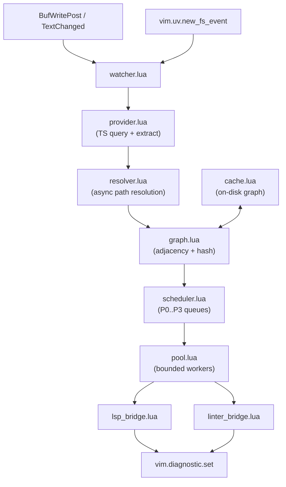
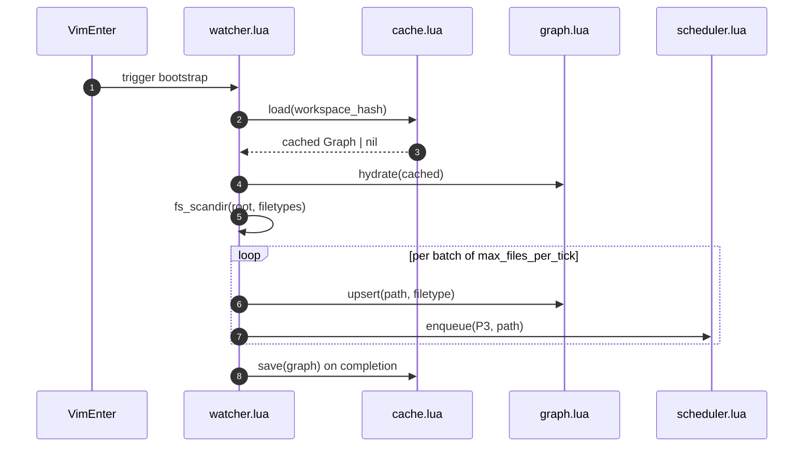
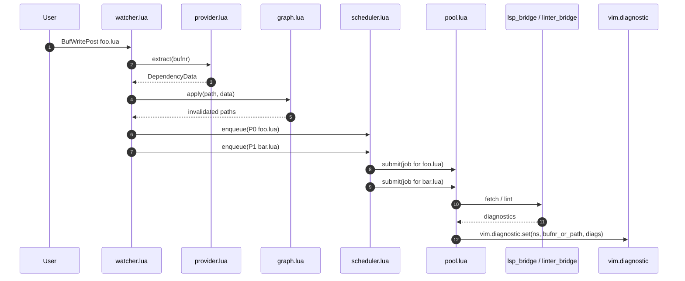
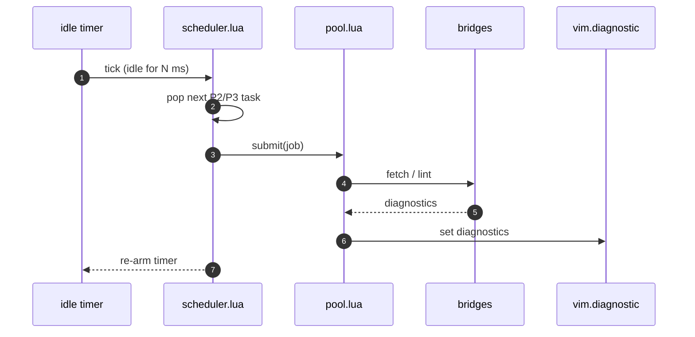
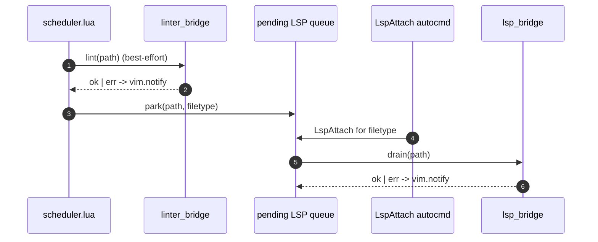

# doktor — Incremental Workspace Diagnostics for Neovim

`doktor` is a Neovim engine that delivers project-wide diagnostics without
keeping an LSP client attached to every file. It builds an approximate
dependency graph with Tree-sitter, schedules work through `plenary.async`
coroutines, and reuses the language servers and linters already configured by
the per-language adapters in [lua/backend/adapters/](lua/backend/adapters/).

It is **not** a language server, **not** a build tool, and **not** a
replacement for semantic analysis — it is a scheduler that orchestrates the
diagnostic sources Neovim already has.

---

## Motivation

LSP today is document-oriented. Even when a server maintains an internal
workspace index, the protocol gives a generic client no standard way to:

- ask which files are affected by a specific file change;
- request a diagnostic re-analysis of an arbitrary, closed file;
- fetch workspace-wide diagnostics purely on-demand.

Generic clients are left with two unappealing options:

1. **Analyze every file** — high memory and CPU usage, completely unscalable
   on large repos.
2. **Analyze only open files** — cheap, but incomplete and fragile; cross-file
   regressions are invisible until the developer happens to open the affected
   file.

`doktor` bridges the gap by building an orchestrator inside Neovim that
selectively fans diagnostic work out across closed files.

---

## Goals

- **Language-agnostic** — driven by per-language Tree-sitter queries supplied
  by adapters, never by hardcoded language logic.
- **Low resource footprint** — bounded memory and CPU usage via an async
  worker pool with explicit concurrency limits.
- **Incremental** — re-evaluate only the files that are structurally or
  statistically likely to have changed.
- **Reuse what exists** — drive the LSP clients and `nvim-lint` linters
  already wired up by [lua/backend/engines/lsp/](lua/backend/engines/lsp/) and
  [lua/backend/engines/linter.lua](lua/backend/engines/linter.lua); never
  spawn parallel processes for the same tool.
- **Decoupled diagnostics** — workspace-wide diagnostic state survives
  without permanently keeping thousands of hidden buffers attached.

## Non-goals

- Becoming an LSP server, semantic analyzer, or type checker.
- Replacing the active-buffer linting that `nvim-lint` already does.
- Driving anything through `:make` / `:compiler!`. The errorformat files in
  [compiler/](compiler/) are being phased out (see Migration Path).
- Cross-language dependency resolution (e.g. a `.ts` file importing from a
  `.py` worker). Each language stays in its own graph partition.

---

## Architecture & Data Flow

```
         User edits an active buffer
                      │
                      ▼
         Tree-sitter updates AST
                      │
                      ▼
     Graph Engine updates dependency state
                      │
                      ▼
    [plenary.async] Priority Queue scheduler
                      │
       ┌──────────────┴──────────────┐
       ▼                             ▼
Priority 0 & 1 Workers        Priority 2 & 3 Workers
(Immediate execution)         (Throttled background)
       │                             │
       └──────────────┬──────────────┘
                      ▼
   LSP bridge      │      Linter bridge
   (hidden buffer  │      (nvim-lint on
   + LSP attach)   │      closed paths)
                      │
                      ▼
       Cached in `vim.diagnostic`
                      │
                      ▼
         Unified Problems View / Loclist
```

The same flow, expressed against the actual Lua modules:



---

## Module Layout

`doktor` lives under [lua/backend/engines/doktor/](lua/backend/engines/doktor/),
mirroring the folder layout used by [lua/backend/engines/lsp/](lua/backend/engines/lsp/).

- `init.lua` — plugin spec + `setup()`, follows the `---@type Plugin` shape
  used by [lua/backend/engines/linter.lua](lua/backend/engines/linter.lua).
- `config.lua` — user-tunable knobs (concurrency, debounce, idle timers,
  hidden-buffer ceiling).
- `graph.lua` — forward/reverse adjacency lists, interface hashes, dirty
  bits.
- `provider.lua` — `DependencyProvider` registry; one provider per filetype,
  registered from adapters.
- `resolver.lua` — async path resolver per language (`require` lookup,
  `tsconfig.json`, `package.json`, etc.).
- `scheduler.lua` — four-priority queue, plenary.async coroutine driver.
- `pool.lua` — bounded worker pool with backpressure.
- `lsp_bridge.lua` — hidden buffer + LSP attach + `publishDiagnostics` await.
- `linter_bridge.lua` — drive `nvim-lint` against transient hidden buffers
  for closed paths.
- `watcher.lua` — autocmds (`BufWritePost`, `TextChanged`) plus
  `vim.uv.new_fs_event` for external changes.
- `cache.lua` — persist the dependency graph to
  `vim.fn.stdpath("cache") .. "/doktor/<workspace-hash>.json"`.
- `commands.lua` — `:Doktor`, `:DoktorRescan`, `:DoktorStatus`.

---

## Initial Bootstrap

On `VimEnter`, the watcher kicks off a **background workspace walk** that
seeds the dependency graph without blocking the UI:

- The walk uses `vim.uv.fs_scandir` (async, batched) starting from the
  workspace root and filtered by every adapter's declared `filetypes`.
- Each discovered file is upserted into the graph and scheduled at
  **Priority 3** so foreground work always wins.
- `bootstrap.max_files_per_tick` caps how many files are touched per
  scheduler tick to keep the editor responsive on huge monorepos.
- Results are persisted via `cache.lua`. On the **next** startup the
  cached graph is loaded first and the background walk only fills gaps
  (new files, modified mtimes), so cold-start cost amortizes over time.
- `bootstrap.on_vim_enter = false` skips the walk entirely for users who
  prefer purely lazy graph construction.



---

## Core Components

### 1. Dependency graph (`graph.lua`)

A reactive in-memory adjacency list. Each file entry tracks:

- **Imports** — modules or files this file consumes.
- **Reverse dependencies** — files that explicitly import this file.
- **Interface hash** — a hash of the file's public exports (see Cache
  invalidation below).

#### Cascading invalidation

```
foo.lua  ◄───  bar.lua  ◄───  baz.lua
```

When `foo.lua` changes, the engine walks the reverse-dependency tree and
schedules refreshes for `foo.lua`, then `bar.lua`, and finally `baz.lua`.
Unrelated files are never touched.

### 2. Async scheduling engine (`scheduler.lua`)

Drives queue management, path resolution, and LSP callback processing on
`plenary.async` coroutines so Neovim's main loop is never blocked.

Diagnostics are prioritized by structural distance from the mutation source:

- **Priority 0** — the actively edited file. Immediate execution on save or
  change.
- **Priority 1** — direct importers (one step away in the reverse graph).
  High-priority execution via the async pool.
- **Priority 2** — transitive importers (more than one step away). Deferred;
  executed once P1 is drained.
- **Priority 3** — remaining stale workspace files. Idle-time execution,
  heavily throttled.

### 3. Dependency providers (`provider.lua`)

Each language adapter registers a Tree-sitter query plus an `extract`
function that maps query captures to dependency data.

### 4. Async path resolver (`resolver.lua`)

Tree-sitter only returns raw text tokens (e.g. `require("app.core")`). A
pluggable, async resolver translates tokens into absolute paths, yielding
while it touches the filesystem or reads project config (`tsconfig.json`,
`package.path`, `pyproject.toml`).

### 5. Bounded worker pool (`pool.lua`)

Limits concurrent LSP / linter evaluations so we don't crash language
servers or saturate memory. Implemented on top of `plenary.async.control`
with a semaphore; tasks waiting on a permit yield rather than spin.

### 6. LSP bridge (`lsp_bridge.lua`)

Uses unlisted hidden buffers to coax diagnostics out of LSP servers for
closed files. Details in **LSP Bridge Algorithm** below.

### 7. Linter bridge (`linter_bridge.lua`)

Peer of the LSP bridge. Drives `nvim-lint` (`require("lint")`) against
transient hidden buffers so a file with no LSP attachment can still produce
linter diagnostics during background scans. Details in **Linter Bridge
Algorithm** below.

---

## Lua API & EmmyLua Types

> Every code block in this section is annotated such that LuaLS / Lua
> Language Server can fully type the implementation from the spec alone.
> Submodules must declare `---@meta` where they only export types, mirroring
> [lua/backend/shared/types.lua](lua/backend/shared/types.lua).

### Adapter additions (`backend/shared/types.lua`)

```lua
---@meta

---@alias DoktorPriority 0|1|2|3
---@alias DoktorConcurrency integer|"auto"

---@class Adapter
---@field filetypes string[]
---@field doktor_linter? string               Linter name; resolved against nvim-lint's registry.
---@field doktor_provider? DependencyProvider
---@field doktor_resolver? PathResolver
```

All of `doktor`, `doktor_cmd`, `doktor_linter_cmd`, `doktor_compiler`, and
`doktor_linter_compiler` are removed — `doktor` ships no compiler-style or
whole-project shell-command fallback (see Migration Path).

### Dependency provider (`provider.lua`)

```lua
---@meta

---@class DependencyData
---@field imports string[] Raw import tokens (e.g. {"../utils", "shims"}).
---@field exports string[] Raw export identifiers used to compute the interface hash.

---@class DependencyProvider
---@field filetypes string[]                                          Filetypes this provider matches.
---@field query string                                                Tree-sitter query string.
---@field extract fun(match: table<string, TSNode>, bufnr: integer): DependencyData

---@class ProviderRegistry
---@field private _by_ft table<string, DependencyProvider>
local ProviderRegistry = {}

---@param provider DependencyProvider
function ProviderRegistry:register(provider) end

---@param filetype string
---@return DependencyProvider|nil
---@nodiscard
function ProviderRegistry:get(filetype) end
```

### Async path resolver (`resolver.lua`)

```lua
---@meta

---@class PathResolver
---@field filetypes string[]
---@async
---@field resolve fun(token: string, context_buf: integer): string|nil

---@class ResolverRegistry
---@field private _by_ft table<string, PathResolver>
local ResolverRegistry = {}

---@param resolver PathResolver
function ResolverRegistry:register(resolver) end

---@param filetype string
---@return PathResolver|nil
---@nodiscard
function ResolverRegistry:get(filetype) end
```

### Dependency graph (`graph.lua`)

```lua
---@meta

---@class GraphNode
---@field path string                Absolute file path.
---@field filetype string
---@field imports string[]           Absolute paths this file imports.
---@field reverse_deps table<string, true> Set of paths that import this file.
---@field interface_hash string|nil  Hash of public exports (nil until first analysis).
---@field dirty boolean              Pending re-evaluation.
---@field volatile boolean           Has unresolvable dynamic imports.

---@class Graph
---@field private _nodes table<string, GraphNode>
local Graph = {}

---@param path string
---@param filetype string
---@return GraphNode
function Graph:upsert(path, filetype) end

---@param path string
---@param data DependencyData
---@return string[] invalidated   Absolute paths whose diagnostics must be rescheduled.
function Graph:apply(path, data) end

---@param path string
---@return string[] direct_dependents
---@nodiscard
function Graph:dependents_of(path) end

---@param path string
---@return string[] transitive_dependents BFS in reverse-dep order.
---@nodiscard
function Graph:transitive_dependents_of(path) end
```

### Scheduler (`scheduler.lua`)

```lua
---@meta

---@class CancellationToken
---@field cancelled boolean             Set by Scheduler:cancel; checked by async jobs at yield points.
---@field reason? "superseded"|"buffer_gone"|"shutdown"

---@class DoktorTask
---@field path string
---@field filetype string
---@field priority DoktorPriority
---@field source "lsp"|"lint"
---@field enqueued_at integer           uv.hrtime() in ns at enqueue.
---@field token CancellationToken       Per-task cancellation handle.

---@class Scheduler
---@field private _queues table<DoktorPriority, DoktorTask[]>
---@field private _pools table<"lsp"|"lint", WorkerPool>
---@field private _pending_lsp table<string, DoktorTask[]> Keyed by filetype; drained on LspAttach.
local Scheduler = {}

---@param task DoktorTask
function Scheduler:enqueue(task) end

---@param path string
---@param reason? "superseded"|"buffer_gone"|"shutdown"
function Scheduler:cancel(path, reason) end

---@async
function Scheduler:drain() end
```

Cancellation is **best-effort cooperative**:

- `Scheduler:cancel(path)` removes any matching task from the priority
  queues immediately.
- For in-flight tasks, the shared `CancellationToken` is flipped to
  `cancelled = true`. Bridge code must check `token.cancelled` at every
  natural yield point (after `a.util.scheduler()`, around `vim.lsp`
  request handlers, between `nvim-lint` callbacks) and bail early.
- The hidden buffer / LSP client is **never** force-detached mid-request;
  the bridge always completes its current syscall before returning,
  preventing LSP-client panics.

### Worker pool (`pool.lua`)

```lua
---@meta

---@generic R
---@alias DoktorJob async fun(): R

---@class WorkerPool
---@field name "lsp"|"lint"          Identity used in :DoktorStatus and logs.
---@field concurrency integer        Resolved max concurrent jobs (integer or "auto" -> vim.uv.available_parallelism()).
---@field private _in_flight integer
---@field private _waiters thread[]
local WorkerPool = {}

---@param opts { name: "lsp"|"lint", concurrency: DoktorConcurrency }
---@return WorkerPool
---@nodiscard
function WorkerPool.new(opts) end

---@async
---@generic R
---@param job DoktorJob<R>
---@param token? CancellationToken
---@return R
function WorkerPool:submit(job, token) end
```

### LSP bridge (`lsp_bridge.lua`)

```lua
---@meta

---@class LspDiagnosticsResult
---@field uri string
---@field diagnostics lsp.Diagnostic[]

---@async
---@param path string
---@param filetype string
---@param timeout_ms integer
---@return LspDiagnosticsResult|nil
local function fetch(path, filetype, timeout_ms) end
```

### Linter bridge (`linter_bridge.lua`)

```lua
---@meta

---@class LinterDiagnosticsResult
---@field path string
---@field diagnostics vim.Diagnostic[]

---@async
---@param path string
---@param linter_name string
---@return LinterDiagnosticsResult|nil
local function lint(path, linter_name) end
```

### Cache (`cache.lua`)

```lua
---@meta

---@class CachedGraph
---@field version integer                  Schema version.
---@field workspace_hash string            Identifies the project root.
---@field nodes table<string, GraphNode>

---@async
---@param graph Graph
function save(graph) end

---@async
---@return Graph|nil
---@nodiscard
function load() end
```

### Config (`config.lua`)

```lua
---@meta

---@class DoktorPoolConfig
---@field lsp DoktorConcurrency             Default: 4. Pass "auto" to scale with vim.uv.available_parallelism().
---@field lint DoktorConcurrency            Default: 4. Same rules; pool only instantiated if any adapter declares doktor_linter.

---@class DoktorBootstrapConfig
---@field on_vim_enter boolean              Default: true. P3-throttled background walk of the workspace on startup.
---@field max_files_per_tick integer        Default: 32. Soft cap on graph upserts per scheduler tick during bootstrap.

---@class DoktorConfig
---@field concurrency DoktorPoolConfig
---@field bootstrap DoktorBootstrapConfig
---@field debounce_ms integer               Default: 250.
---@field idle_ms integer                   Default: 2000.
---@field max_hidden_buffers integer        Default: 16.
---@field cache_path string                 Always under vim.fn.stdpath("cache").."/doktor/<workspace-hash>.json".
---@field notify_on_error boolean           Default: true. Surfaces bridge errors via vim.notify (see No-LSP Behavior).
---@field log_level "trace"|"debug"|"info"|"warn"|"error"
```

Concurrency contract:

- Two **separate** pools by default — `lsp` and `lint` — each with its own
  concurrency knob. A slow LSP server cannot starve the linter, and vice
  versa.
- The `lint` pool is only constructed when at least one adapter declares
  `doktor_linter`. Without any linter in the workspace, `lint` defaults
  are still accepted but never instantiated.
- Defaults are fixed integers (`4` for each pool), **never** autoscaled
  implicitly.
- Users opt into autoscaling per pool by passing `"auto"`, which resolves
  once at startup via `vim.uv.available_parallelism()`.
- The same knob is exposed through the public setup API:

```lua
require("backend.engines.doktor").setup({
  concurrency = {
    lsp = "auto",   -- scale LSP-bridge workers with available cores
    lint = 8,       -- explicit override for the linter pool
  },
  bootstrap = { on_vim_enter = true, max_files_per_tick = 32 },
  notify_on_error = true,
})
```

---

## Sequence Diagrams

### Save-triggered diagnostic flow



### Idle drain of P2 and P3



### External filesystem change

```mermaid
sequenceDiagram
    autonumber
    participant Fs as vim.uv.new_fs_event
    participant W as watcher.lua
    participant G as graph.lua
    participant S as scheduler.lua

    Fs->>W: change event for path
    W->>G: mark dirty + recompute hash
    G-->>W: invalidated dependents
    W->>S: enqueue(P1 invalidated)
    Note over W,S: No active buffer; doktor is the<br/>only diagnostic source for this file.
```

---

## LSP Bridge Algorithm

Because the LSP spec doesn't support forcing diagnostics on arbitrary paths,
`lsp_bridge.lua` wraps headless buffers:

1. **Acquire buffer** — `vim.api.nvim_create_buf(false, true)` for the target
   file (unlisted, scratch).
2. **Attach LSP** — manually attach the filetype's configured client. Reuse
   the existing client from
   [lua/backend/engines/lsp/](lua/backend/engines/lsp/) rather than spawning
   a new one.
3. **Await diagnostics** — wrap
   `vim.lsp.handlers["textDocument/publishDiagnostics"]` with
   `plenary.async.wrap` and yield until the handler fires for the target
   URI, or `timeout_ms` elapses.
4. **Cache & clean** — push the result into the `doktor` `vim.diagnostic`
   namespace, then detach and `nvim_buf_delete` the hidden buffer.

```lua
local a = require("plenary.async")

---@async
---@param path string
---@param filetype string
---@param timeout_ms integer
---@return LspDiagnosticsResult|nil
local function fetch(path, filetype, timeout_ms)
  local bufnr = vim.api.nvim_create_buf(false, true)
  vim.api.nvim_buf_set_name(bufnr, path)
  vim.bo[bufnr].filetype = filetype

  local result = a.wrap(function(cb)
    local handle
    handle = vim.api.nvim_create_autocmd("LspNotify", {
      buffer = bufnr,
      callback = function(args)
        if args.data.method == "textDocument/publishDiagnostics" then
          cb(args.data.params)
          vim.api.nvim_del_autocmd(handle)
          return true
        end
      end,
    })
  end, 1)()

  vim.api.nvim_buf_delete(bufnr, { force = true })
  return result
end
```

---

## Linter Bridge Algorithm

`linter_bridge.lua` mirrors the LSP bridge but targets `nvim-lint`:

1. **Acquire buffer** — same as the LSP bridge.
2. **Load file contents** — `vim.api.nvim_buf_set_lines` with the on-disk
   contents (read async via `vim.uv.fs_read` to avoid blocking).
3. **Invoke linter** — `require("lint").try_lint(linter_name, { ignore_errors = true })`
   scoped to the hidden buffer. `nvim-lint` writes into
   `vim.diagnostic.set` in its own namespace; the bridge captures via a
   namespace override.
4. **Re-namespace & clean** — copy the captured diagnostics into the
   `doktor` namespace keyed by absolute path, then wipe the buffer.

The bridge runs only when the target file's adapter declares a
`doktor_linter` and the linter binary is available (`AdapterScanner`'s
`check_executable` already enforces this; see
[lua/backend/shared/AdapterScanner.lua](lua/backend/shared/AdapterScanner.lua)).

---

## Edge Cases & Mitigation

### Dynamic imports

Static syntax analysis fails on runtime expressions:

- Lua: `require(some_variable)`
- JavaScript: `await import(computedPath)`
- Python: `importlib.import_module(name)`

**Mitigation** — the provider marks the file's `GraphNode.volatile = true`.
Volatile files trigger a conservative full-fanout rescan during P3 idle
time.

### Interface hashing (truncating cascades)

To avoid massive domino recomputation when a developer only tweaks a
comment or an internal variable:

- The provider optionally computes a hash of the file's **public exports**
  via the same Tree-sitter query.
- If a file changes but its interface hash is unchanged, the scheduler
  **truncates the cascade** — P0 still runs, but P1 and P2 are cancelled.

### LSP reattach race vs buffer wipe

If the scheduler tries to wipe a hidden buffer while the LSP client is
mid-request, the request can panic. Mitigation: wait for either
`publishDiagnostics` or `LspDetach`, whichever fires first, before calling
`nvim_buf_delete`.

### Symlinked workspaces

`vim.uv.fs_realpath` is called once per path on insertion into the graph;
all graph keys are realpath-normalized so two symlinks to the same file
collapse to a single node.

### Monorepo roots

Each language adapter resolves its own workspace root (e.g. nearest
`tsconfig.json`, `Cargo.toml`, `pyproject.toml`). The graph partitions
nodes by root; `Graph:transitive_dependents_of` never crosses partitions.

### Concurrent saves to the same file

The scheduler deduplicates by `(path, source)` on enqueue: a pending task
for the same target is replaced rather than duplicated, and an in-flight
task is allowed to finish (results overwrite cleanly thanks to a single
`vim.diagnostic.set` per result).

### No-LSP behavior

When a scheduled file has no LSP client attached (server not configured,
not running, or failing to start), the scheduler runs **both** bridges
opportunistically:

1. **Linter bridge fires immediately** — if the file's adapter declares a
   `doktor_linter`, `nvim-lint` produces diagnostics for that path on the
   spot. This is the "best-effort right now" lane.
2. **LSP task is parked** — the same task is moved into a pending queue
   keyed by filetype. The next `LspAttach` for a matching filetype drains
   the queue and runs the LSP bridge for each parked path.
3. **Error surfacing** — if either bridge errors (linter binary missing,
   LSP attach times out, hidden-buffer panic, etc.) and
   `config.notify_on_error` is true, the scheduler emits a single throttled
   `vim.notify(..., vim.log.levels.WARN)` per `(path, source)` per session
   so the user knows a file is silently un-diagnosed.



---

## Integration With Existing Engines

- [lua/backend/engines/linter.lua](lua/backend/engines/linter.lua) keeps its
  own autocmd-driven linting for the **active buffer**. `doktor` only
  schedules **background** fan-out (P1+), so the two cannot fight.
- [lua/backend/engines/lsp/](lua/backend/engines/lsp/) keeps full ownership
  of attached clients. `doktor`'s LSP bridge only piggy-backs onto already
  running clients; it never starts a new one.
- `doktor` writes into **two** namespaces it owns:
  `vim.api.nvim_create_namespace("doktor.lsp")` and
  `vim.api.nvim_create_namespace("doktor.lint")`. Separate namespaces make
  source-specific ownership transfer (below) and `:DoktorStatus` filtering
  trivial. The default config in
  [lua/config/diagnostics.lua](lua/config/diagnostics.lua) is unaffected.

### Ownership transfer on `LspAttach`

When the native LSP attaches to a file that was previously diagnosed in
the background by `doktor`:

1. Clear the `doktor.lsp` namespace for that path — the real LSP client
   now owns those diagnostics and the engine in
   [lua/backend/engines/lsp/](lua/backend/engines/lsp/) will publish them
   through its own namespace. This prevents duplicate signs and virtual
   lines.
2. **Keep** the `doktor.lint` namespace for that path. The native
   [linter.lua](lua/backend/engines/linter.lua) handles the active buffer,
   but for files that linter never touches (e.g. dependencies of the
   active buffer, freshly opened sibling tabs before the autocmd fires)
   doktor's linter-source diagnostics remain authoritative until the
   active-buffer linter writes its own.
3. The active path is also moved to the head of the P0 queue so the next
   user save triggers an immediate refresh.

---

## Migration Path

1. Delete [domains/editor/nvim/config/compiler/](compiler/) (`eslint.vim`,
   `go.vim`, `mypy.vim`, `ruff.vim`, `rustc.vim`, `shellcheck.vim`,
   `tsc.vim`). `doktor` ships no compiler-style integration.
2. Remove the following fields from the `Adapter` class in
   [lua/backend/shared/types.lua](lua/backend/shared/types.lua):
   `doktor`, `doktor_cmd`, `doktor_compiler`, `doktor_linter_cmd`,
   `doktor_linter_compiler`.
3. Remove the same fields from each adapter under
   [lua/backend/adapters/](lua/backend/adapters/) (currently only
   [javascript.lua](lua/backend/adapters/javascript.lua) sets them).
   Keep `doktor_linter = "eslint"`.
4. Add `doktor_provider` / `doktor_resolver` to adapters that ship their
   own Tree-sitter dependency extraction.
5. Wire `require("backend.engines.doktor")` into the lazy spec list in
   [lua/backend/init.lua](lua/backend/init.lua) (it is already covered by
   `PluginLoader.load("backend", { exclude = { "adapters", "shared" } })`,
   so the engine just needs to land in `engines/`).

---

## Future Enhancements

- **Persistent cache** — already part of the core design via `cache.lua`;
  future work is bumping the schema version safely.
- **Build-system integration** — read `Cargo.toml`, `go.mod`,
  `pyproject.toml`, or `package.json` workspaces directly to bootstrap the
  dependency graph instantly before Tree-sitter evaluation runs.
- **External FS watching** — already wired via `vim.uv.new_fs_event`; future
  work is debouncing storms (e.g. `git checkout` of a large branch).
- **Telemetry** — `:DoktorStatus` showing queue depths, in-flight workers,
  cache hit rate, and per-file last-evaluated timestamps.
- **Injected languages** — handle Tree-sitter language injections so
  `.vue`, `.svelte`, and markdown code fences contribute their inner
  language's diagnostics.

---

## Resolved Decisions

- **No compiler integration, no shell fallback** — all `:compiler!`
  errorformat files are deleted and no `doktor_cmd` / whole-project
  shell-command path exists. Diagnostics come exclusively from the LSP and
  linter bridges driving existing tooling.
- **Cache location** — always
  `vim.fn.stdpath("cache") .. "/doktor/<workspace-hash>.json"`. The
  workspace tree is never written to.
- **Concurrency** — fixed integer default (`4`); never autoscaled
  implicitly. Users may opt in to autoscaling by passing
  `concurrency = "auto"` to `require("backend.engines.doktor").setup(...)`,
  which resolves once to `vim.uv.available_parallelism()`.
- **No-LSP behavior** — best-effort linter immediately, park an LSP task
  to drain on the next matching `LspAttach`, and surface any bridge error
  via `vim.notify` when `notify_on_error` is enabled (default on). See
  [No-LSP behavior](#no-lsp-behavior).
- **Initial bootstrap** — `VimEnter` triggers a P3-throttled background
  workspace walk capped at `bootstrap.max_files_per_tick` files per tick.
  Results persist via `cache.lua` so subsequent startups are incremental.
- **Active-buffer ownership** — when `LspAttach` fires for a path,
  doktor's `doktor.lsp` namespace is cleared for that path (native LSP
  takes over); the `doktor.lint` namespace is left intact until the
  active-buffer linter overwrites it.
- **Pool topology** — two pools by default (`lsp`, `lint`), each with its
  own user-configurable concurrency knob. The `lint` pool is only built
  if any adapter declares `doktor_linter`.
- **Cancellation** — cooperative; `Scheduler:cancel(path)` removes pending
  tasks immediately and flips a `CancellationToken` that in-flight bridge
  code must check at yield points. Hidden buffers are never force-killed
  mid-request to avoid LSP-client panics.
